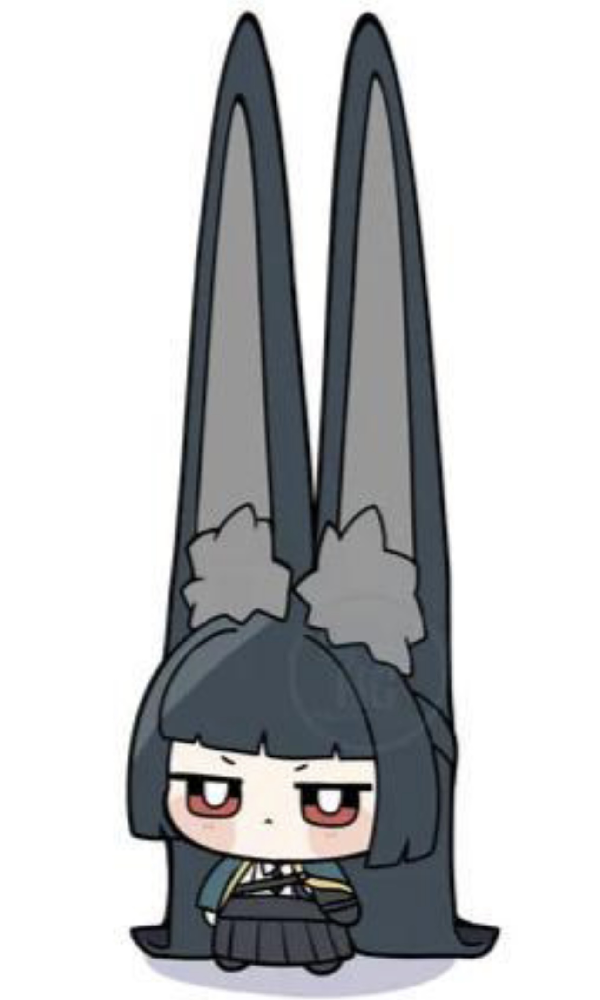

# MacroVoron

<ins>**Don't copy paste, this is more just an example**</ins>

With love, from Suzuki

☆*: .｡. o(≧▽≦)o .｡.:*☆

*Start Macros:*
| Name | Description | Slicer/Console gcode | Standalone | Chamber Sensor |
| -------- | -------- | -------- | -------- | -------- |
| StartBland.cfg | The most common start macro | `_PRINT_START EXTRUDER=Meow BED=Meow` | ❌ | ❌ |
| SoakTimeStart.cfg | Print start with an X min heatsoak | `_PRINT_START EXTRUDER=Meow BED=Meow SOAK_TIME=Meow CHAMBER=Meow` | ❌ | ❌ |
| MaterialSoakStart.cfg | Soak or not depends on the material | `_PRINT_START EXTRUDER=Meow BED=Meow HEATUP_TEMP=Meow MATERIAL=[filament_type[initial_extruder]]` | ❌ | ✅ |
| SoaktoStart.cfg | Print start that reaches a specific chamber temp to start print | `_PRINT_START EXTRUDER=Meow BED=Meow HEATUP_TEMP=Meow CHAMBER=Meow` | ❌ | ✅ |

*End Macros:*
| Name | Description | Slicer/Console gcode | Standalone |
| -------- | -------- | -------- | -------- |
| EndBland.cfg | The most common end macro | `_PRINT_END` | ❌ |
| EndSafeZ.cfg | Moves the z axis by a specified "safe z" after end | `_PRINT_END` | ❌ |

*Purge Lines:*
| Name | Description | Slicer/Console gcode | Standalone |
| -------- | -------- | -------- | -------- |
| Cura-purge-line.cfg | Purge line taken from cura | `_CURA_PURGE_LINE` | ❌ |

*Random:*
| Name | Description | Slicer/Console gcode | Standalone |
| -------- | -------- | -------- | -------- |
| LoadFilament.cfg | Push filament into the hotend | `LOAD_FILAMENT` | ✅ |
| UnloadFilament.cfg | Pull out the filament from the hotend | `UNLOAD_FILAMENT` | ✅ |

*Macro add-ons:*
| Name | Description  |
| -------- | -------- |
| BedFan.cfg | Describes macro changes if using a bed fan(s) |
| BedFanBetter.cfg | A better alternative to the normal BedFan.cfg |

  
<a property="dct:title" rel="cc:attributionURL" href="https://github.com/Suzu0071/MacroVoron">MacroVoron</a> by <a rel="cc:attributionURL dct:creator" property="cc:attributionName" href="https://github.com/Suzu0071">Suzu0071</a> is licensed under <a href="https://creativecommons.org/licenses/by-nc-sa/4.0/?ref=chooser-v1" target="_blank" rel="license noopener noreferrer" style="display:inline-block;">Creative Commons Attribution-NonCommercial-ShareAlike 4.0 International</a>
 
